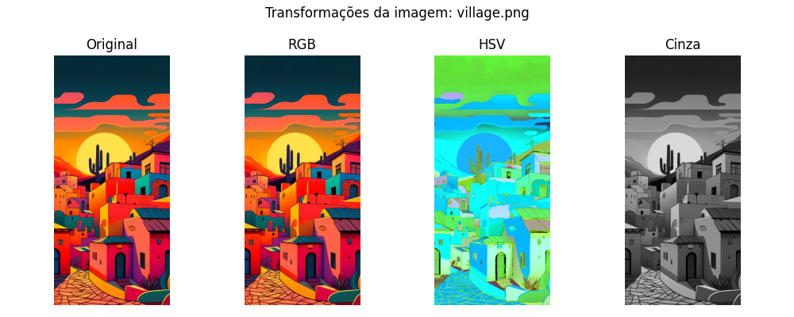
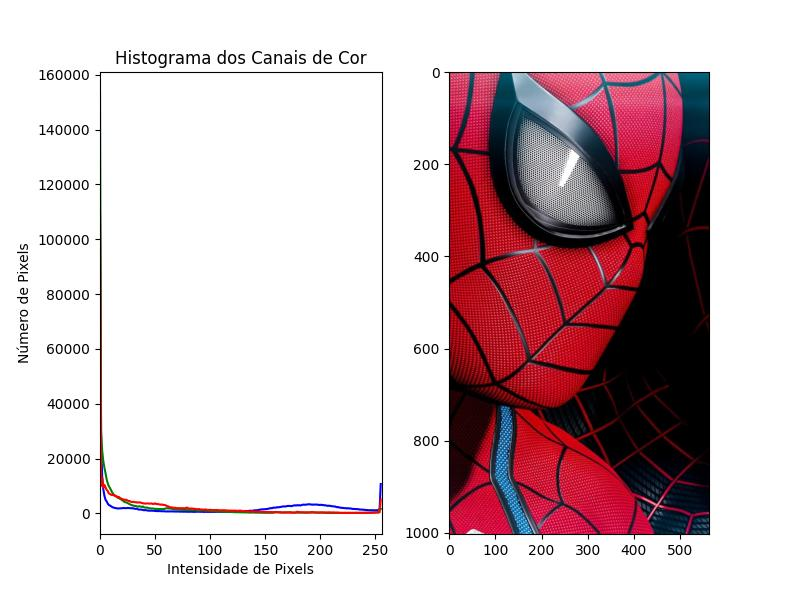
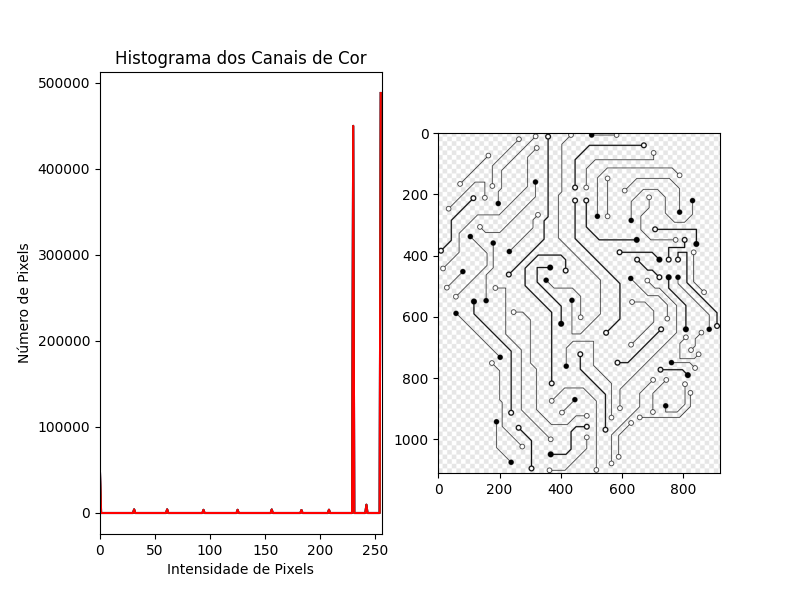
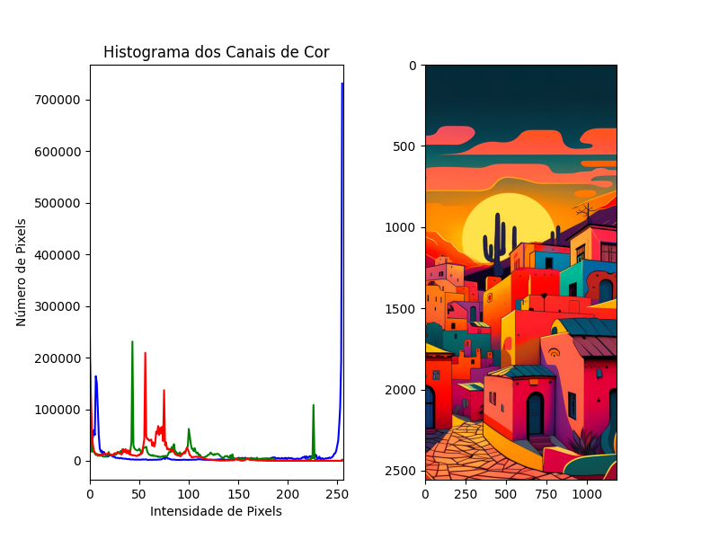
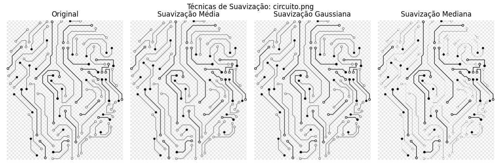
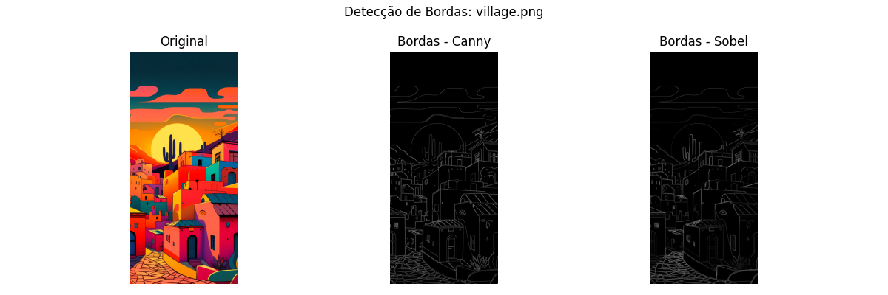

# Introdução ao Processamento de Imagens com Python

Nesta aplicação, exploraremos os fundamentos do processamento de imagens utilizando Python. O objetivo é compreender como essas técnicas funcionam e como podem ser aplicadas na área da ciência da computação. O processamento de imagens é uma disciplina essencial, com aplicações que vão desde a análise de imagens médicas até a visão computacional.

Para isso, utilizaremos a biblioteca [OpenCV](https://docs.opencv.org/4.x/d6/d00/tutorial_py_root.html), muito utilizada no Python para processamento e análise de imagens, e o [Matplotlib](https://matplotlib.org/), para visualizar o resultado do processamento. Vamos utilizar essas bibliotecas para a [conversão de imagens](#conversão-de-imagens-para-rgb-hsv--cinza), [suavização](#suavização-das-imagens), [análise de histograma](#análise-de-histograma) e detecção de bordas.

## Conversão de imagens para RGB, HSV & Cinza

Aqui utilizamos uma função do OpenCV chamada `cvtColor` para converter as imagens para RGB, HSV e Cinza.

No [código](https://github.com/MagnoMF/processamento-de-imagens/blob/main/src/ler_converter.py), vamos utilizar três funções para conversão:
- `cv2.COLOR_BGR2RGB`
- `cv2.COLOR_BGR2HSV`
- `cv2.COLOR_BGR2GRAY`

### RGB
O **RGB** (Red, Green, Blue) é um modelo de cores aditivas amplamente utilizado em dispositivos eletrônicos, como monitores e câmeras (dispositivos que emitem luz). Ele combina três cores primárias, vermelho (Red), verde (Green) e azul (Blue), em diferentes intensidades para criar todas as cores. Os componentes do **RGB** são:

- **Vermelho (Red):** Representa a intensidade da cor vermelha, variando de 0 a 255.
- **Verde (Green):** Representa a intensidade da cor verde, também variando de 0 a 255.
- **Azul (Blue):** Representa a intensidade da cor azul, variando de 0 a 255.

### HSV
O **HSV** (Hue, Saturation, Value) é um modelo de cores muito utilizado em design gráfico e detecção de objetos. Os componentes principais dele são:

- **Matiz (Hue):** Representa a cor em graus de 0 a 360.
- **Saturação (Saturation):** Indica a intensidade da cor, de 0% (desbotada) a 100% (pura).
- **Valor (Value):** Refere-se ao brilho da imagem, de 0% (preto) a 100% (brilho máximo).

Com essa estrutura, o HSV facilita ajustes de brilho e saturação, além de ser eficaz na manipulação de cores em processamento de imagem.

### Cinza
A **escala de cinza** é uma representação de imagens em tons de cinza, onde cada pixel possui um valor que varia de 0 (preto) a 255 (branco). Esse modelo reduz a complexidade das imagens ao eliminar a informação de cor, focando apenas na intensidade da luz.

Muito utilizado no **reconhecimento facial**, pois essa conversão ajuda o algoritmo de reconhecimento a focar nas características importantes, como contornos e formas. Essa técnica também reduz o nível de processamento, tornando o reconhecimento mais rápido.

## Análise de Histograma

[Código](https://github.com/MagnoMF/processamento-de-imagens/blob/main/src/histograma.py) para extração do histograma.

Para fazer a análise do histograma, primeiro separamos os canais Red, Green e Blue da imagem e depois varremos a imagem para saber com que frequência cada cor é utilizada. Um gráfico de histograma para análise de cores é representado por dois eixos:

- **Eixo X (Horizontal):** Representa os valores de intensidade dos pixels. Para imagens em escala de cinza, esse eixo varia de 0 a 255, onde 0 representa o preto, 255 representa o branco, e os valores intermediários representam os tons de cinza.
- **Eixo Y (Vertical):** Representa a frequência ou contagem de pixels que possuem uma determinada intensidade. Um valor mais alto indica que há mais pixels com aquela intensidade específica.

#### Imagem 1:
Aqui podemos ver que a maior frequência de pixels está mais próxima de 0 no eixo X, o que significa que a imagem é mais escura.

#### Imagem 2:
Aqui a frequência de pixels está mais à direita, próximo ou quase no 255, indicando que a imagem é mais clara.

#### Imagem 3:
Um ótimo exemplo de contraste. Podemos ver que as cores seguem uma linha de frequência mais alta em alguns trechos, formando quase uma linha reta.

## Suavização das Imagens

Para entendermos a suavização, utilizaremos a imagem do circuito.
Aqui aplicamos três técnicas: média, gaussiana e mediana. O [código](https://github.com/MagnoMF/processamento-de-imagens/blob/main/src/suavizacao.py) pode ser acessado para um entendimento mais detalhado.

- **Média:** Utiliza uma janela de pixels (aqui usamos 5x5). O valor central dessa janela é substituído pela média dos valores ao redor. Embora eficaz para reduzir ruídos, pode borrar detalhes importantes da imagem.
  
- **Mediana:** Similar à média, mas usa a mediana dos valores na janela. É eficaz para remover ruídos do tipo "sal e pimenta", onde a média e a gaussiana podem falhar.

- **Gaussiana:** A matriz utilizada é definida pelos valores da função gaussiana, de modo que a soma dos valores da matriz seja igual a 1. Isso resulta em um desfoque mais suave na imagem, preservando melhor as bordas e contornos.

## Detecção de Bordas

Uma imagem interessante na detecção de bordas foi a da vila. Utilizamos duas técnicas: Canny e Sobel. A implementação pode ser vista no [código](https://github.com/MagnoMF/processamento-de-imagens/blob/main/src/deteccao_bordas.py).

### Canny
A detecção de bordas utilizando Canny tem quatro etapas:

1. Suavização Gaussiana para reduzir o ruído.
2. Cálculo dos gradientes, utilizando operadores Sobel para calcular as mudanças de intensidade nas direções X e Y.
3. Supressão de não-máximos, mantendo apenas os pixels com a maior intensidade ao longo da direção do gradiente.
4. Histerese, definindo dois limiares (alto e baixo) para decidir se um pixel é considerado parte de uma borda.

#### Vantagens Canny:
- Alta precisão, detecta bordas fortes e fracas com boa robustez.
- Resistente ao ruído, devido à suavização gaussiana inicial.
- Detecção robusta, conectando bordas fracas a bordas fortes.

#### Desvantagens:
- Mais lento, devido ao processo em múltiplas etapas.
- Sensível à escolha dos limiares, exigindo ajustes cuidadosos.

### Sobel
O método Sobel utiliza derivadas para calcular as mudanças de intensidade dos pixels em uma imagem. Ele aplica dois filtros Sobel (para os eixos X e Y) para detectar bordas nas direções horizontal e vertical.

#### Vantagens:
- Simples e rápido de implementar.
- Detecta bordas nas direções horizontal e vertical separadamente.
- Suavização leve, ajudando a reduzir pequenos ruídos.

#### Desvantagens:
- Sensível ao ruído.
- Menos preciso, com maior probabilidade de perder bordas fracas.

