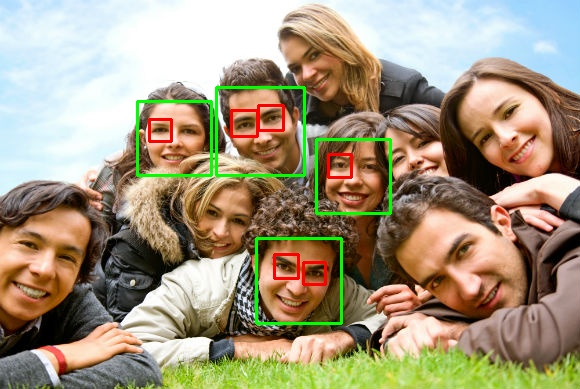
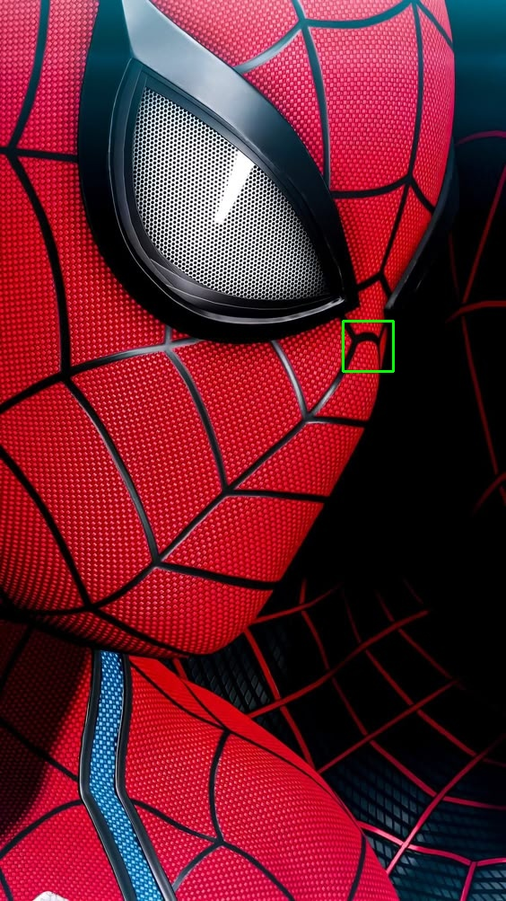

<h1 align="center">Processamento de Imagens com Python</h1>

## Tópico

- [Introdução](#introdução)
- [Instalação](#instalação)
- [Conversão de Imagens](#conversão-de-imagens-para-rgb-hsv--cinza)
- [Suavização](#suavização-das-imagens)
- [Análise de Histograma](#análise-de-histograma)
- [Detecção de Bordas](#detecção-de-bordas)
- [Detecção de Faces e Olhos](#detecção-face-e-olhos)

## Introdução

Nesta aplicação, exploraremos os fundamentos do processamento de imagens utilizando Python. O objetivo é compreender como essas técnicas funcionam e como podem ser aplicadas na área da ciência da computação. O processamento de imagens é uma disciplina essencial, com aplicações que vão desde a análise de imagens médicas até a visão computacional.

Para isso, utilizaremos a biblioteca [OpenCV](https://docs.opencv.org/4.x/d6/d00/tutorial_py_root.html), muito utilizada no Python para processamento e análise de imagens, e o [Matplotlib](https://matplotlib.org/), para visualizar o resultado do processamento. Vamos utilizar essas bibliotecas para a [conversão de imagens](#conversão-de-imagens-para-rgb-hsv--cinza), [suavização](#suavização-das-imagens), [análise de histograma](#análise-de-histograma), [detecção de bordas](#detecção-de-bordas) e [detecção de faces e olhos](#detecção-face-e-olhos).


## Instalação

Para executar a aplicação no **Windows** ou **Linux**, é necessário seguir alguns passos para garantir que a instalação seja feita corretamente.

### 1. **Instalar o Python**

Caso você não tenha o Python 3 instalado, basta seguir o [tutorial de instalação](https://curso.grupysanca.com.br/pt/latest/instalacao.html).

### 2. **Criar um ambiente virtual (virtualenv)**

Para executar a aplicação, precisamos instalar algumas bibliotecas. Para garantir que essas bibliotecas não fiquem salvas diretamente em seu sistema, vamos criar um ambiente virtual reservado para elas. Consulte o tutorial de [instalação e ativação da virtualenv](https://docs.python.org/pt-br/3/library/venv.html).

### 3. **Ativar o ambiente virtual**

- **Linux**:

```bash
source nome_do_ambiente_virtual/bin/activate
```

- **Windows**:

```bash
nome_do_ambiente\Scripts\activate
```

Caso queira desativar o ambiente virtual, basta executar:

```bash
deactivate
```

### 4. **Instalar as bibliotecas Python**

Agora vamos instalar as bibliotecas necessárias. Na pasta raiz do projeto, temos um arquivo chamado [requirements.txt](https://github.com/MagnoMF/processamento-de-imagens/blob/main/requirements.txt). Este arquivo contém todas as bibliotecas utilizadas na aplicação, então basta executar o comando abaixo para instalar as dependências a partir deste arquivo.

Com o ambiente virtual ativado, execute:

```bash
pip install -r requirements.txt
```

Em **Linux**, talvez seja necessário instalar alguns pacotes adicionais para exibição das imagens. No entanto, caso não queira exibir as imagens, elas serão salvas na pasta **img_processadas**.

```bash
sudo apt-get install libfreetype6-dev libxft-dev
```

## Executando a aplicação

Na pasta `src`, você pode executar o arquivo principal `run.py`:

```bash
python run.py
```

Caso prefira executar os arquivos separadamente, você também pode. Lembre-se de que os arquivos `carregar_imagens.py`, `logger.py` e `verificar_pastas.py` são apenas funções auxiliares, e executá-los separadamente não terá efeito algum.

```bash
python nome_arquivo.py
```

## Conversão de imagens para RGB, HSV & Cinza

Aqui utilizamos uma função do OpenCV chamada `cvtColor` para converter as imagens para RGB, HSV e Cinza.

No [código](https://github.com/MagnoMF/processamento-de-imagens/blob/main/src/ler_converter.py), vamos utilizar três funções para conversão:
- `cv2.COLOR_BGR2RGB`
- `cv2.COLOR_BGR2HSV`
- `cv2.COLOR_BGR2GRAY`

### RGB
O **RGB** (Red, Green, Blue) é um modelo de cores aditivas amplamente utilizado em dispositivos eletrônicos, como monitores e câmeras (dispositivos que emitem luz). Ele combina três cores primárias, vermelho (Red), verde (Green) e azul (Blue), em diferentes intensidades para criar todas as cores. Os componentes do **RGB** são:

- **Vermelho (Red):** Representa a intensidade da cor vermelha, variando de 0 a 255.
- **Verde (Green):** Representa a intensidade da cor verde, também variando de 0 a 255.
- **Azul (Blue):** Representa a intensidade da cor azul, variando de 0 a 255.

### HSV
O **HSV** (Hue, Saturation, Value) é um modelo de cores muito utilizado em design gráfico e detecção de objetos. Os componentes principais dele são:

- **Matiz (Hue):** Representa a cor em graus de 0 a 360.
- **Saturação (Saturation):** Indica a intensidade da cor, de 0% (desbotada) a 100% (pura).
- **Valor (Value):** Refere-se ao brilho da imagem, de 0% (preto) a 100% (brilho máximo).

Com essa estrutura, o HSV facilita ajustes de brilho e saturação, além de ser eficaz na manipulação de cores em processamento de imagem.

### Cinza
A **escala de cinza** é uma representação de imagens em tons de cinza, onde cada pixel possui um valor que varia de 0 (preto) a 255 (branco). Esse modelo reduz a complexidade das imagens ao eliminar a informação de cor, focando apenas na intensidade da luz.

Muito utilizado no **reconhecimento facial**, pois essa conversão ajuda o algoritmo de reconhecimento a focar nas características importantes, como contornos e formas. Essa técnica também reduz o nível de processamento, tornando o reconhecimento mais rápido.


## Análise de Histograma

[Código](https://github.com/MagnoMF/processamento-de-imagens/blob/main/src/histograma.py) para extração do histograma.

Para fazer a análise do histograma, primeiro separamos os canais Red, Green e Blue da imagem e depois varremos a imagem para saber com que frequência cada cor é utilizada. Um gráfico de histograma para análise de cores é representado por dois eixos:

- **Eixo X (Horizontal):** Representa os valores de intensidade dos pixels. Para imagens em escala de cinza, esse eixo varia de 0 a 255, onde 0 representa o preto, 255 representa o branco, e os valores intermediários representam os tons de cinza.
- **Eixo Y (Vertical):** Representa a frequência ou contagem de pixels que possuem uma determinada intensidade. Um valor mais alto indica que há mais pixels com aquela intensidade específica.

#### Imagem 1:
Aqui podemos ver que a maior frequência de pixels está mais próxima de 0 no eixo X, o que significa que a imagem é mais escura.


#### Imagem 2:
Aqui a frequência de pixels está mais à direita, próximo ou quase no 255, indicando que a imagem é mais clara.


#### Imagem 3:
Um ótimo exemplo de saturação é a imagem da vila, que tem picos agrupados das cores RGB.


## Suavização das Imagens

Para entendermos a suavização, utilizaremos a imagem do circuito.
Aqui aplicamos três técnicas: média, gaussiana e mediana. O [código](https://github.com/MagnoMF/processamento-de-imagens/blob/main/src/suavizacao.py) pode ser acessado para um entendimento mais detalhado.

- **Média:** Utiliza uma janela de pixels (aqui usamos 5x5). O valor central dessa janela é substituído pela média dos valores ao redor. Embora eficaz para reduzir ruídos, pode borrar detalhes importantes da imagem.
  
- **Mediana:** Similar à média, mas usa a mediana dos valores na janela. É eficaz para remover ruídos do tipo "sal e pimenta", onde a média e a gaussiana podem falhar.

- **Gaussiana:** A matriz utilizada é definida pelos valores da função gaussiana, de modo que a soma dos valores da matriz seja igual a 1. Isso resulta em um desfoque mais suave na imagem, preservando melhor as bordas e contornos.


## Detecção de Bordas

Uma imagem interessante na detecção de bordas foi a da vila. Utilizamos duas técnicas: Canny e Sobel. A implementação pode ser vista no [código](https://github.com/MagnoMF/processamento-de-imagens/blob/main/src/deteccao_bordas.py).

### Canny
A detecção de bordas utilizando Canny tem quatro etapas:

1. Suavização Gaussiana para reduzir o ruído.
2. Cálculo dos gradientes, utilizando operadores Sobel para calcular as mudanças de intensidade nas direções X e Y.
3. Supressão de não-máximos, mantendo apenas os pixels com a maior intensidade ao longo da direção do gradiente.
4. Histerese, definindo dois limiares (alto e baixo) para decidir se um pixel é considerado parte de uma borda.

#### Vantagens Canny:
- Alta precisão, detecta bordas fortes e fracas com boa robustez.
- Resistente ao ruído, devido à suavização gaussiana inicial.
- Detecção robusta, conectando bordas fracas a bordas fortes.

#### Desvantagens:
- Mais lento, devido ao processo em múltiplas etapas.
- Sensível à escolha dos limiares, exigindo ajustes cuidadosos.

### Sobel
O método Sobel utiliza derivadas para calcular as mudanças de intensidade dos pixels em uma imagem. Ele aplica dois filtros Sobel (para os eixos X e Y) para detectar bordas nas direções horizontal e vertical.

#### Vantagens:
- Simples e rápido de implementar.
- Detecta bordas nas direções horizontal e vertical separadamente.
- Suavização leve, ajudando a reduzir pequenos ruídos.

#### Desvantagens:
- Sensível ao ruído.
- Menos preciso, com maior probabilidade de perder bordas fracas.


## Detecção Face e Olhos

Para fazer a detecção de rosto e olhos utilizamos o algoritmo de Haarcascade (classificação em cascata), um algoritmo que detecta objetos baseado em suas caracteristicas visuais e aprendizado de máquina. A implementação do código pode ser vista no [código](https://github.com/MagnoMF/processamento-de-imagens/blob/main/src/deteccao_faces.py).

O funcionamento do algoritmo é simples.

1. Ele detecta os objetos de interesse, rostos, olhos, boca, etc.. utilizando o Cascade Classifier, que foi trinado utilizando AdaBoost utilizando várias exemplos de imagens com objetos de interesse e sem os objetos de interesse.

2. Durante esse detecção de objetos ele divide a imagem em várias janelas pequenas e aplica o classificador para verificar se o objeto está presente.

3. Para fazer a detecção dos objetos de tamanhos diferentes ele redimensiona a imagem várias vezes cirando uma pirâmede de escala, aplicando o classificador em cada escala.

4. Ele classifica as regioões a serem analisadas de forma rápida e sem muitos critérios e depois analisa novamente as etapas selecionadas com um pouco mais de critério

5. Por ultimo ele pega as janelas selecionadas e aplica a classificação para detectar os objetos presentes.

Com tantas etapas o processo parece ser demorado, porém ele é rapido por conta de utilizar integrais da imagem que permite computar os pixeis em uma região de forma rápida e também por conta da eliminação das regiões que não interessam para o algorimo.

Como nem tudo é perfeito o Haarcascade tem algumas limitações, como por exemplo a rotação da imagem, iluminação ou ruídos que podem atrapalhar.


## Detecção de Rosto e Olhos com Haarcascade

Para realizar a detecção de rostos e olhos, utilizamos o algoritmo **Haarcascade** (classificação em cascata), que detecta objetos com base em suas características visuais e aprendizado de máquina.

### Funcionamento do Algoritmo

1. **Treinamento do Cascade Classifier**  
   O algoritmo detecta objetos de interesse (como rostos, olhos e boca) utilizando o *Cascade Classifier*, que foi treinado com o método [AdaBoost](#adaboost). Esse treinamento utiliza vários exemplos de imagens com e sem os objetos de interesse.

2. **Janela de Busca**  
   Durante a detecção, a imagem é dividida em várias janelas pequenas, e o classificador é aplicado em cada uma delas para verificar se o objeto está presente.

3. **Pirâmide de Escala**  
   Para detectar objetos de diferentes tamanhos, a imagem é redimensionada várias vezes, criando uma **pirâmide de escala**. O classificador é aplicado em cada uma dessas escalas.

4. **Classificação em Etapas**  
   As regiões da imagem são analisadas de forma rápida, utilizando critérios simples. As regiões que passam nessa análise inicial são revisadas com critérios mais rigorosos em etapas subsequentes.

5. **Detecção Final**  
   As janelas selecionadas são avaliadas detalhadamente para confirmar a presença dos objetos de interesse.

### Desempenho

Apesar de tantas etapas, o algoritmo é rápido devido a dois fatores:
- **Integrais de Imagem**: Permitem calcular a soma de pixels em regiões específicas de forma eficiente.
- **Eliminação de Regiões Não Relevantes**: Áreas que não contêm objetos de interesse são descartadas rapidamente.

### Limitações

Embora eficiente, o Haarcascade tem algumas limitações:
- **Rotação da Imagem**: O algoritmo pode falhar se o objeto estiver inclinado ou em ângulos diferentes.
- **Iluminação**: Variações de luz podem afetar a precisão.
- **Ruídos na Imagem**: Elementos indesejados ou má qualidade da imagem podem interferir nos resultados.

### AdaBoost
O AdaBoost (abreviação de Adaptive Boosting) é um algoritmo de aprendizado de máquina baseado no conceito de ensemble learning. Ele combina vários "modelos fracos" (classificadores simples que têm desempenho ligeiramente melhor que um palpite aleatório) para criar um "modelo forte" que é altamente preciso.

### Análise das imagens.

Procurei uma imagem no Google em que tivesse várias pessoas para realizar o teste. Como a imagem tem várias pessoas, podemos fazer alguns testes com o fator de escala do código que será utilizado na pirâmide de escalas.

Com o fator de escala *1.1* conseguimos detectar 4 rostos com o tempo de 0.37s.

```
scaleFactor = 1.1
faces = face_cascade.detectMultiScale(imagem[1], scaleFactor, minNeighbors=5, minSize=(30, 30))
```



Com o ajuste do fator de escala, podemos optar por mais desempenho, porém menor precisão, ou maior precisão, porém menor desempenho, ou, no caso do fator que utilizamos acima, um equilíbrio entre os dois.

Se optarmos por uma precisão maior, podemos utilizar um fator de escala menor. Com esse fator, encontramos 5 rostos, porém ele levará um tempo maior para fazer o processamento, passando de 0.37s para 0.54s.


Como estamos lidando com apenas 1 imagem, esta diferença não é muito significativa. Porém, em um sistema de autenticação por biometria facial, este tempo será significativo para a aplicação, tendo em vista que vamos comparar 1 imagem com outras mil imagens. Mas ainda assim, há maneiras de contornar isso deixando as imagens já pré-processadas em um banco de dados.

```
scaleFactor = 1.05
faces = face_cascade.detectMultiScale(imagem[1], scaleFactor, minNeighbors=5, minSize=(30, 30))
```

Com esse fator de escala mais baixo, em algumas imagens o algoritmo pode classificar de forma errada algumas imagens, por exemplo.



Nesta imagem, ele classificou um ponto em que não há rosto algum.